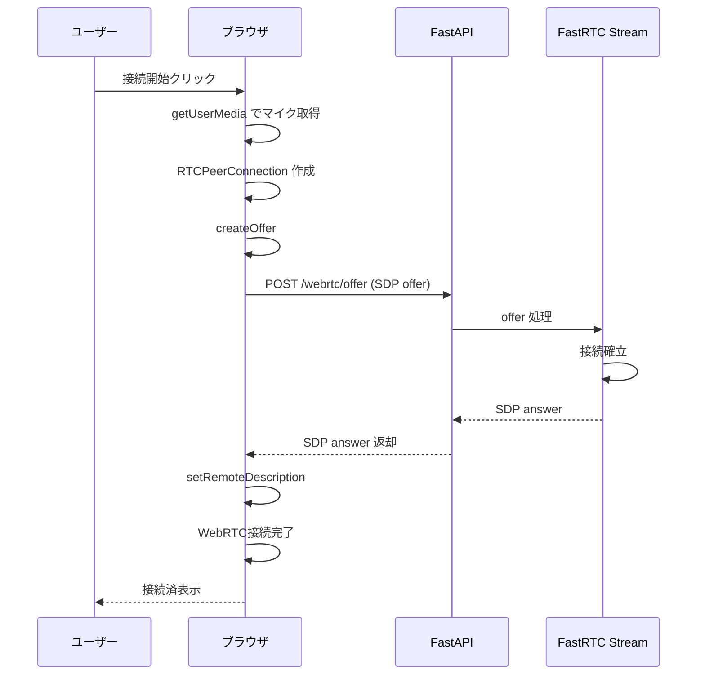
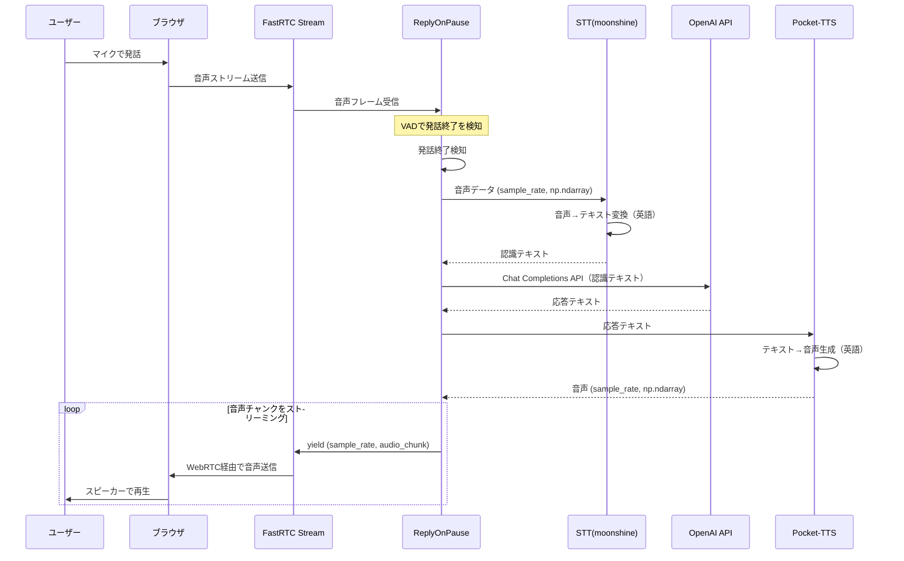

# バックエンド シーケンス図

本ドキュメントは [requirements.md](requirements.md) の要件に基づくバックエンドの処理シーケンスを定義する。

---

## 1. WebRTC接続確立シーケンス

フロントエンドが接続開始ボタンを押下した際の、WebRTC接続確立までの流れ。

---

## 2. 音声対話シーケンス（1ターン）

ユーザーが発話し、AIが音声で応答するまでの1ターンの処理フロー。要件 4. データフローに準拠。

---

## 3. シーケンスの補足

### 3.1 発話終了検知（VAD）

- FastRTCの `ReplyOnPause` が内蔵するVAD（Voice Activity Detection）により、ユーザーの発話終了を自動検知する
- 検知後、それまでの音声データをまとめてSTTに渡す

### 3.2 割り込み（Interruption）

- デフォルトで `can_interrupt=True` のため、AI応答再生中にユーザーが話し始めると、応答が中断され新規ターンが開始される
- 要件上は明示されていないが、FastRTCの標準挙動として利用可能

### 3.3 エラーハンドリング

| フェーズ | 想定エラー | 対応方針 |
|---------|------------|----------|
| WebRTC接続 | 接続失敗 | フロントにエラー返却、再接続可能にする |
| STT | 認識失敗・空文字 | エラーメッセージまたは無音を返す |
| OpenAI API | APIエラー・レート制限 | エラーメッセージをTTSで読み上げ、または再接続案内 |
| Pocket-TTS | 生成失敗 | フォールバックメッセージまたは再試行 |

---

## 4. 要件との対応

| 要件（requirements.md） | 本シーケンスでの対応 |
|-------------------------|----------------------|
| 4. データフロー 1〜6 | シーケンス図 2 に反映 |
| 5.1 ReplyOnPause | 発話終了検知〜応答生成の中心として配置 |
| 5.1 STT (moonshine) | 音声→テキスト変換として配置 |
| 5.1 OpenAI API | Chat Completions として配置 |
| 5.1 Pocket-TTS | テキスト→音声変換として配置 |
| 5.1 音声形式 (sample_rate, np.ndarray) | STT入力・Pocket-TTS出力で使用 |
