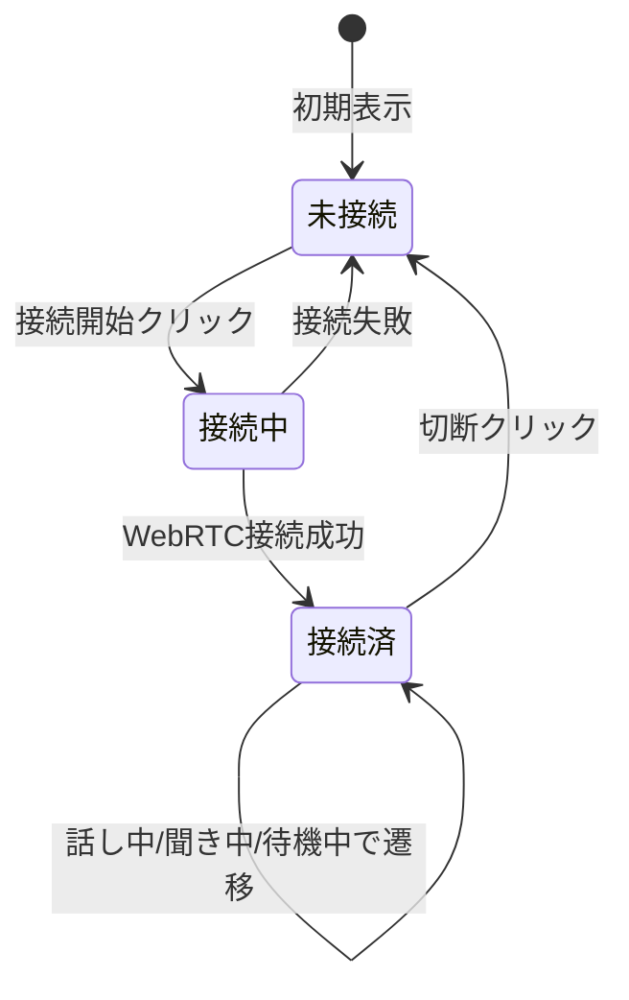

# フロントエンド 画面構成

本ドキュメントは [requirements.md](requirements.md) の要件に基づくフロントエンドの画面構成を定義する。

---

## デザイン方針

- **シンプルでフラットなデザイン**（要件 5.2 に準拠）
- 余計な装飾を排し、機能に集中したUI
- フラットデザイン（影・グラデーションを抑えた平面的な見た目）

---

## 画面構成

本アプリは**単一画面**で構成する。音声対話に特化し、画面遷移は行わない。

### 画面レイアウト（ワイヤーフレーム）

```
┌─────────────────────────────────────────────────────────┐
│                     アプリタイトル                         │
├─────────────────────────────────────────────────────────┤
│                                                         │
│              ┌─────────────────────┐                    │
│              │ マイク選択 [▼]       │  ← 音声入力デバイス   │
│              └─────────────────────┘                    │
│              ┌─────────────────────┐                    │
│              │ スピーカー選択 [▼]   │  ← 音声出力デバイス   │
│              └─────────────────────┘                    │
│                                                         │
│              ┌─────────────────────┐                    │
│              │   接続状態表示        │                    │
│              │  (未接続/接続中/接続済) │                    │
│              └─────────────────────┘                    │
│                                                         │
│              ┌─────────────────────┐                    │
│              │   [接続開始] ボタン   │  ← 未接続時のみ表示   │
│              └─────────────────────┘                    │
│                                                         │
│              ┌─────────────────────┐                    │
│              │   マイク状態表示      │                    │
│              │  (待機中/話し中/聞き中) │                   │
│              └─────────────────────┘                    │
│                                                         │
│              ┌─────────────────────┐                    │
│              │   [切断] ボタン      │  ← 接続中のみ表示    │
│              └─────────────────────┘                    │
│                                                         │
│              ┌─────────────────────┐                    │
│              │  音声出力用 <audio>  │  ← 非表示（再生のみ）  │
│              └─────────────────────┘                    │
│                                                         │
└─────────────────────────────────────────────────────────┘
```

---

## 画面要素

| 要素 | 説明 | 表示条件 |
|------|------|----------|
| アプリタイトル | アプリ名（例: "AI Voice Chat"） | 常時 |
| マイク選択 | 音声入力デバイス（マイク）のドロップダウン。`navigator.mediaDevices.enumerateDevices()` で取得した audioinput 一覧から選択 | 常時（接続前は自由に変更、接続中は変更時に再接続が必要な場合あり） |
| スピーカー選択 | 音声出力デバイス（スピーカー）のドロップダウン。audiooutput 一覧から選択。`HTMLMediaElement.setSinkId()` で出力先を切り替え | 常時 |
| 接続状態表示 | 未接続 / 接続中 / 接続済 | 常時 |
| 接続開始ボタン | WebRTC接続を開始するボタン | 未接続時 |
| マイク状態表示 | 待機中 / 話し中（録音中）/ 聞き中（AI応答再生中） | 接続済時 |
| 切断ボタン | WebRTC接続を終了するボタン | 接続中・接続済時 |
| 音声出力 | AI応答音声の再生（`<audio>` 要素、非表示） | 接続済時 |

---

## 状態遷移



### マイク状態（接続済時）

| 状態 | 説明 |
|------|------|
| 待機中 | ユーザーの発話を待っている状態 |
| 話し中 | ユーザーが発話中（VADで検知）、または発話終了後AI応答待ち |
| 聞き中 | AIの音声応答を再生中 |

---

## 技術的対応（要件との対応）

| 要件（requirements.md） | 本画面での実装 |
|-------------------------|----------------|
| 5.2 UIデザイン: シンプルでフラット | フラットなボタン・パネル、装飾を抑えたレイアウト |
| 5.2 WebRTC接続: `/webrtc/offer` に POST | 接続開始ボタン押下時に `RTCPeerConnection` で offer を送信 |
| 5.2 音声入出力: getUserMedia, `<audio>` | 接続時に選択したマイクで取得、AI応答は選択したスピーカーで再生 |
| 5.2 デバイス選択 | マイク選択・スピーカー選択のドロップダウンで切り替え可能 |
| 5.2 Data Channel | 必要に応じてテキスト（認識結果等）を表示する拡張余地を確保 |

---

## コンポーネント構成（React想定）

```
App
├── Header（タイトル）
├── AudioDeviceSelector（音声デバイス選択）
│   ├── MicrophoneSelect（マイク選択ドロップダウン）
│   └── SpeakerSelect（スピーカー選択ドロップダウン）
├── ConnectionStatus（接続状態表示）
├── ConnectButton（接続開始ボタン）
├── MicrophoneStatus（マイク状態表示）
├── DisconnectButton（切断ボタン）
└── AudioOutput（非表示の <audio> 要素）
```

### デバイス選択の実装メモ

- **マイク**: `getUserMedia({ audio: { deviceId: { exact: selectedDeviceId } } })` で選択したデバイスを指定。接続中に変更した場合は、新しいストリームで再接続が必要
- **スピーカー**: `HTMLMediaElement.setSinkId(deviceId)` で出力先を切り替え。接続中でも即時反映可能
