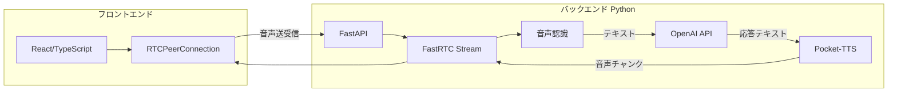

# AI対話アプリ 要件定義書

## 1. 概要・目的

- **アプリの目的**: WebRTCを利用したリアルタイムAI音声対話
- **ユーザー体験**: ユーザーがマイクで話しかけ、AIが音声で応答する双方向コミュニケーション
- **言語**: 初版はSTT・TTSともに英語のみ対応

---

## 2. 技術スタック

| レイヤー | 技術 | 用途 |
|---------|------|------|
| バックエンド | Python 3.10+ | メイン言語 |
| パッケージ管理 | uv | 依存関係管理・仮想環境 |
| リアルタイム通信 | FastRTC | WebRTC/WebSocketによる音声ストリーミング |
| Webフレームワーク | FastAPI | FastRTCのマウント先 |
| フロントエンド | TypeScript + React.js | カスタムUI |
| AIテキスト生成 | OpenAI API | チャット補完（GPT-4等） |
| AI音声合成 | Pocket-TTS | テキスト→音声変換（オンデバイス、CPU推論）**英語のみ** |
| 音声認識（STT） | FastRTC内蔵（moonshine） | 音声→テキスト変換 **英語のみ** |

---

## 3. システムアーキテクチャ

---

## 4. データフロー

1. **ユーザー発話** → ブラウザマイク → WebRTC音声ストリーム → FastRTC
2. **発話終了検知** → FastRTCの `ReplyOnPause` がVADで検知
3. **音声→テキスト** → STT（FastRTC内蔵 moonshine、英語）
4. **テキスト生成** → OpenAI API（Chat Completions）
5. **テキスト→音声** → Pocket-TTSで音声生成
6. **音声ストリーミング** → `(sample_rate, np.ndarray)` 形式で yield → WebRTC → ブラウザ再生

---

## 5. 主要コンポーネント仕様

### 5.1 バックエンド（Python）

- **FastRTC Stream**: `modality="audio"`, `mode="send-receive"`
- **ハンドラ**: `ReplyOnPause` で発話終了時に応答生成
- **Pocket-TTS連携**: FastRTCは `(sample_rate, np.ndarray)` を期待。Pocket-TTSの `generate_audio()` 出力を `(tts_model.sample_rate, audio.numpy())` に変換し、必要に応じて shape `(1, num_samples)` に整形
- **マウント**: `stream.mount(app)` で FastAPI にマウント

### 5.2 フロントエンド（React/TypeScript）

- **UIデザイン**: シンプルでフラットなデザインとする
- **WebRTC接続**: `RTCPeerConnection` で `/webrtc/offer` に POST
- **音声入出力**: `getUserMedia` でマイク取得、`<audio>` で受信音声再生
- **Data Channel**: テキスト用（必要に応じて）

### 5.3 外部API・モデル

- **OpenAI API**: `OPENAI_API_KEY` 環境変数、Chat Completions 使用
- **Pocket-TTS**: `uv add pocket-tts`（または `uv sync` で一括インストール）、モデル ~300MB、CPU推論対応、英語音声（例: "alba" 等のプリセットボイス）

---

## 6. 非機能要件（案）

- **レイテンシ**: 発話終了から初音声まで 2秒以内を目標
- **対応ブラウザ**: WebRTC対応（Chrome, Firefox, Safari, Edge）
- **セキュリティ**: APIキーは環境変数で管理、HTTPS必須（本番）

---

## 7. 検討事項・オープンクエスチョン

- **Pocket-TTSのストリーミング**: 現状は一括生成。チャンク分割して yield する実装が必要
- **将来の多言語対応**: 日本語等への拡張は別フェーズで検討

---

## 参考リンク

- [FastRTC](https://fastrtc.org/) - 公式ドキュメント
- [FastRTC Audio](https://fastrtc.org/userguide/audio/) - 音声ストリーミング、ReplyOnPause、TTS/STT
- [Pocket-TTS](https://huggingface.co/kyutai/pocket-tts) - Hugging Face
- [FastRTC LLM Voice Chat](https://huggingface.co/spaces/fastrtc/llm-voice-chat) - 公式サンプル
